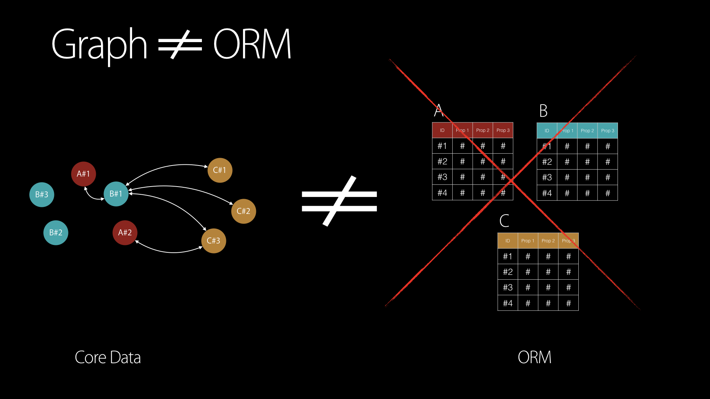
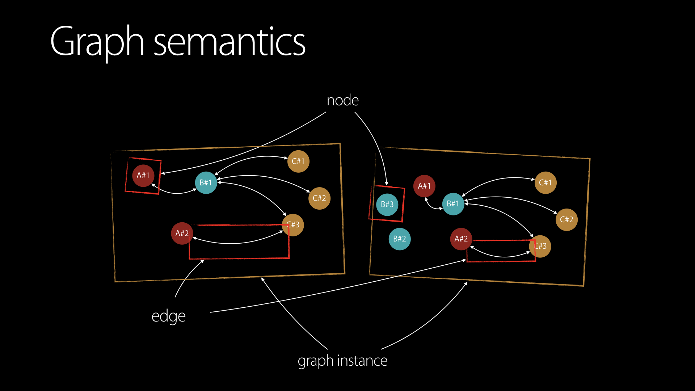
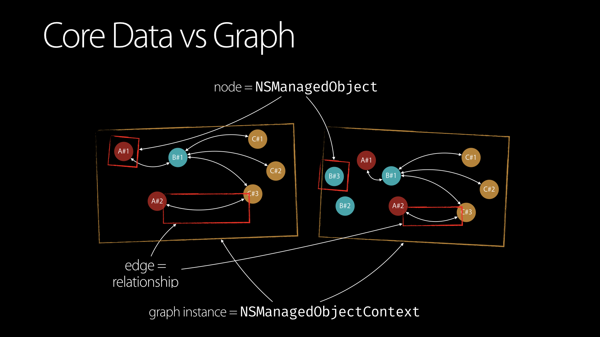
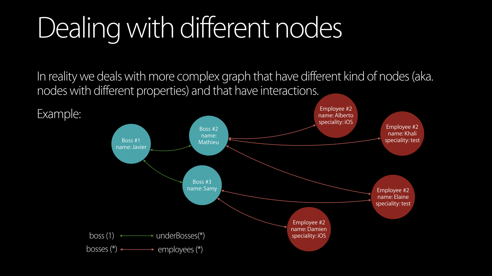
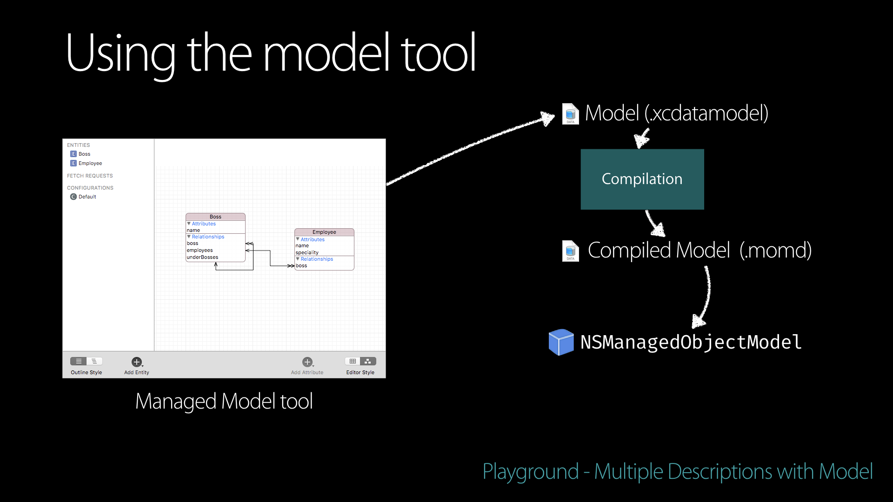

+++
title="A taste of CoreData - Part 0 - A graph framework"
date="2018-02-19"
comments = true
published = false
[taxonomies]
tags = ["ios", "coredata", "modeling", "graph"]
categories = ["programming", "apple"]
+++

Before 2011, I was mainly working on C++/Qt for Gnu/Linux operating systems. I really enjoyed the documentation set and the clear tutorials the development team provided along with the SDK. I guess that still today, you can find a lot of answers by simply reading the documentation or some of the provided code samples.

When I dived into the Apple world, I was glad to see that plenty of good resources was also provided for the main frameworks. You usually takes the same path when you are using a library for the first time: reading the programmming guide, reading the the main classes documentation and may be watching
some WWDC introducton videos. Most of the times, this is enough to remove the magic and understand how the mechanics work.

I would say that this is not true for CoreData. It is the only framework I heard people avoid to use because they see it as too complex and badly documented.

Badly documented may be too harsh. I would say that the information about CoreData is widespread in a lot of differents places. I would even say, that some information are "hidden" only inside some WWDC videos, especially regarding the concurrency and the potential stack configurations [^1].
Hopefully, different books have been published (I would recommend [^2] and [^3]) that help to find the missing pieces of this big puzzle.

I would like to start a series of post presenting CoreData using a different approach, starting more from the code documentation and trying to provide some explanations about how the framework seems to work under the hood.

All the code related to the series will be pusblished on this github repository: [https://github.com/yageek/a-taste-of-core-data](https://github.com/yageek/a-taste-of-core-data).

# What is CoreData?

Describing CoreData is not so easy. A lot of developers I met simply describes Core Data as an **Object Relational Mapper (ORM)** library around SQLite. You could agree with this, but it does not describes CoreData completely/correctly.

According to me, the best description has been provided by [Matt Thompson](https://twitter.com/@mattt) inside his [post](http://nshipster.com/core-data-libraries-and-utilities/) on [NSHipster.com](https://nshispter.com):

_Contrary to popular belief, **Core Data is not an Object-Relational Mapper**, but **rather an object graph and persistence framework**, capable of much more than the Active Record pattern alone is capable of. **Using Core Data as an ORM** necessarily limits the capabilities of Core Data and muddies its conceptual purity. But for many developers longing for the familiarity of an ORM, this trade-off is a deal at twice the price!_  - Matt Thomson
{: .notice }

The key elements here are **object graph** and **persistence**. 

You use CoreData to create graphes of objects and you would eventually persist thoses graphes on the disk.

It differs from the notion of an **ORM** in the sense that you manipulate a graph of connected nodes instead of manipulating a set of records stored in a set of tables.



-   ORM/SQLITE: involves mostly writing SQL statements that returns Record (Pure Value elements) from a sets of  tables.
-   Graph: involves looking for object instances (node) from a specific graph instance.

# Why using CoreData?

The next question is why would you use CoreData? There are plenty of reason to use CoreData:

- To create the _Model_ part of your MVVM/MVC architecture.
- To persist this model in the disk if needed.
- Simplify the feeding of UI elements.
- Advanced usages can be used to help synchronization with backend services.

# CoreData as a graph framework

One graph is composed of nodes and edges. 



CoreData has three classes representing those notions:

- Graph: `NSManagedObjectContext`
- Node: `NSManagedObject`
- Edge: `NSRelationshipDescription`



## How do we create a graph?

### Graph
Creating a graph is equivalent to create an instance of the `NSManagedObjectContext` class. This class has only [one designated initializer](https://developer.apple.com/documentation/coredata/nsmanagedobjectcontext/1506709-init)
`initWithConcurrencyType:`.

```swift
let context = NSManagedObjectContext(concurrencyType: .mainQueueConcurrencyType)
```

Don't pay attention to the provided constant for now, we'll detail it in a future post. Just remind that after
this call, a new instance of one graph is created.

## Node

Creating a node is equivalent to create one instance of the `NSManagedObject` class. If we take a look at the [documentation](https://developer.apple.com/documentation/coredata/nsmanagedobject?language=objc), we discover that this class has two designated initalizers, [`initWithContext:`](https://developer.apple.com/documentation/coredata/nsmanagedobject/1640602-initwithcontext?language=objc) and [`initWithEntity:insertIntoManagedObjectContext:`](https://developer.apple.com/documentation/coredata/nsmanagedobject/1506357-initwithentity?language=objc).

As we have no idea about what an `NSEntityDescription` is, let's try to use the `initWithContext:` that requires simply a reference to a `NSManagedObjectContext` instance (aka. the graph instance).

Let's try the following code:

```swift
// Graph
let context = NSManagedObjectContext(concurrencyType: .mainQueueConcurrencyType)
// Node
let node = NSManagedObject(context: context)
```

And test it inside a playground:


Creating the node like this does not seems to be the right way. If we would have read the complete
documentation of this method, this crash wouldn't be a surprise:

_This method is only legal to call on subclasses of NSManagedObject that represent a single entity in the model._
{: .notice }

As we have no idea about why would we have subclasses of nodes for now, we have no other choice than trying the other option.

The `initWithEntity:insertIntoManagedObjectContext:` method requires one instance of the `NSEntityDescription` class along with one instance of the `NSManagedObjectContext` class. 
What is the purpose of `NSEntityDescription`?

## Modeling the nodes and the graph

You should ask yourself why CoreData would need another piece of information than the graph instance to create our node?

Generally, the graph you're creating using CoreData is an abstraction that matches a real concept of your own. In this concept, you may have differents type of nodes and some specific rules about how the nodes can be connected. Each node would also hold some data.

CoreData is expecting this piece of information in the form of one instance of the `NSEntityDescription` class. 
Creating a graph without a basic set of rules would not make sense.

Let's imagine a simple set of rules for the rest of this post. We want to create a graph representing the organization graph of a company. We have two types of node:

-   **Boss**: A named person that (generally) rarely code and manages one or more people. This person has also at most one boss on top of her.
-   **Employee**: A named person that (generally) manages no one due to high productivity and has a speciality. This person can have multiple bosses.

From those sentences we can create a basic set of rules:
- We have two types of nodes: `Boss` and `Employee`.
- A `Boss` node has a `name` property.
- An `Employee` node has one `name` property and one `speciality` property.
- A `Boss` node has a link to several `Employee` nodes. Let's call this link `employees`.
- A `Boss` node has a link to a specific `Boss` node (it's own boss). Let's call this link `boss`.
- A `Boss` node has a link to the bosses under him. Let's call this link `underbosses`.
- An `Employee` node a link to all his own bosses. Let's call this link `bosses`.


All those rules can be splitted into two categories:

- Attribute: The data attached to the node. (`name` and `property` here)
- Relationship: The rules describing how the nodes can be linked. (`boss`, `bosses`, `employees` and `underbosses`)

CoreData has exactly two classes that represent those concepts: `NSAttributeDescription` and `NSRelationshipDescription` (both inherit from `NSPropertyDescription`). In fact, `NSEntityDescription` is just a container around a set of `NSPropertyDescription` subclasses.
To create the rules, we would just need to create the appropriate instances of `NSAttributeDescription` and `NSRelationshipDescription` describing our business logic.

Let's start with the different containers for our `Employee` and `Boss` nodes. Each container is identified by its `name` property:

```swift
// Boss Description
let bossDescription = NSEntityDescription()
bossDescription.name = "Boss"

// Employee Description
let employeeDescription = NSEntityDescription()
employeeDescription.name = "Employee"
```

Then we continue with the different existing attributes:

```swift
// Attributes
let nameBossAttr = NSAttributeDescription()
nameBossAttr.name = "name"
nameBossAttr.attributeType = .stringAttributeType
nameBossAttr.defaultValue = "No Name For Boss"

let nameEmployeeAttr = NSAttributeDescription()
nameEmployeeAttr.name = "name"
nameEmployeeAttr.attributeType = .stringAttributeType

let specialityAttr = NSAttributeDescription()
specialityAttr.name = "speciality"
specialityAttr.attributeType = .stringAttributeType
```

You should notice that:
- Each attribute is identified by its `name` property.
- Each attribute has a type (`attributeType`). You can check the [`NSAttributeType`](https://developer.apple.com/documentation/coredata/nsattributetype) enum for all the available types.
- You can provide a default value if needed.

Now we can describe the relationships:

```swift
// Relationships
let bossOneRel = NSRelationshipDescription()
bossOneRel.name = "boss"
bossOneRel.minCount = 0
bossOneRel.maxCount = 1 // To-One
bossOneRel.destinationEntity = bossDescription

let underBossesRel = NSRelationshipDescription()
underBossesRel.name = "underBosses"
underBossesRel.minCount = 0
underBossesRel.maxCount = 0 // To-Many
underBossesRel.deleteRule = .nullifyDeleteRule
underBossesRel.destinationEntity = bossDescription

bossOneRel.inverseRelationship = underBossesRel
underBossesRel.inverseRelationship = bossOneRel

let bossesMulRel = NSRelationshipDescription()
bossesMulRel.name = "bosses"
bossesMulRel.minCount = 0
bossesMulRel.maxCount = 0  // To-Many
bossesMulRel.deleteRule = .nullifyDeleteRule
bossesMulRel.destinationEntity = bossDescription

let employeeMulRel = NSRelationshipDescription()
employeeMulRel.name = "employees"
employeeMulRel.minCount = 0
employeeMulRel.maxCount = 0  // To-Many
employeeMulRel.deleteRule = .nullifyDeleteRule
employeeMulRel.destinationEntity = employeeDescription
```

Each relationship object is identified by its `name` property. You configure the relationship with the following options:
- `destinationEntity`: The name of the `NSEntityDescription` targeted by this relationship.
- `minCount`: The minimum value of nodes targeted by this relationship.
- `maxCount`: The maximum value of nodes targeted by this relationship. Using `0` means no limit.
- `deleteRule`: When the node hosting this relationship is deleted, this property tells to CoreData what to do with the targeted node(s) (delete them also, simply cut the edges, etc). 

Now we can assign each properties to the corresponding `NSEntityDescription`:

```swift
// Assign Relationships
bossDescription.properties = [employeeMulRel, underBossesRel, bossOneRel, nameBossAttr];
employeeDescription.properties = [bossesMulRel, nameEmployeeAttr, specialityAttr];
```

If you have paid attention to the relationship's rules, you would have notice that some relationships are kind of "connected". Getting the `bosses` property of the `Employee` node is the opposite of getting the `employees` property of the `Boss` node.
By opposite I mean that if you have one `Employee` node and you get one `Boss` node through the `bosses` property, you can go back to the `Employee` instance by using the `employees` property of the `Boss` node.

This should be expressed in CoreData by using the `inverseRelationship` property of `NSRelationshipDescription`:

```swift
// Specifying inverse
bossesMulRel.inverseRelationship = employeeMulRel
employeeMulRel.inverseRelationship = bossesMulRel
```

Now we can try to create a graph and one `Boss` node inside it:

```swift
// Create an object and insert it
let context = NSManagedObjectContext(concurrencyType: .mainQueueConcurrencyType)
let obj1 = NSManagedObject(entity: bossDescription, insertInto: context)

// Check the context status.
print("The context has now: \(context.insertedObjects.count) objects inserted.")
```
The output gives us:

```
The context has now: 1 objects inserted.
```

Great, we succeeded to create a graph instance and one node!

# Reducing the boilerplate code with `NSManagedObjectModel`

Our current graph rules are basic and you would have noticed that we required a lot of lines
to describes them. Using code is not the only way to describe our business logic. Inside the documentation of the `NSEntityDescription`, you will find this sentence:

_You usually define entities in a Managed object model using the data modeling tool in Xcode_
{: .notice }

If you have heard about CoreData before, the *Managed Object Model* is the first tool you have been presented
to without any further information. It will help to create a bunch of `NSEntityDescription` with a graphical editor. This will produce one `.xcdatamodel` model file that will be compiled into one `.momd` file.

If this file is present in your application's bundle, you will be able to access it from CoreData API to create one `NSManagedObjectModel` instance.



A `NSManagedObjectModel` instance is basically a bag that contains all the `NSEntityDescription`, `NSAttributeDescription` and `NSRelationshipDescription` we defined in the editor.

Assuming you have recreated the previous rules using a `.xcdatamodel`, you can load them using the `NSManagedObjectModel` class:

```swift
let fileURL = Bundle.main.url(forResource: "SimpleGraph", withExtension: "momd")!
let model = NSManagedObjectModel(contentsOf: fileURL)!
```

Then we can retrieve the `NSEntityDescription` we are interested in and reuse the same code to instantiate the node and the graph:
```swift
let bossDescription = model.entitiesByName["Boss"]!

// Create an object and insert it
let context = NSManagedObjectContext(concurrencyType: .mainQueueConcurrencyType)
let obj1 = NSManagedObject(entity: bossDescription, insertInto: context)

// Check the context status.
print("The context has now: \(context.insertedObjects.count) objects inserted.")
```
And the output is exactly the same as before.

# Working on the node

Creating empty nodes is not really usefull. We should be able to modify the data they contain and create connections between them. For now we have a graph of basic `NSManagedObject` instances.


How do we access to the node's properties we have defined? By taking a look to the `NSManagedObject` documentation, a paragraph gives us some information:

_**Core Data automatically generates accessor methods (and primitive accessor methods) for you**. For attributes and to-one relationships, Core Data generates the standard get and set accessor methods; for to-many relationships, **Core Data generates the indexed accessor methods as described in Achieving Basic Key-Value Coding Compliance in Key-Value Coding Programming Guide**. You do however need to declare the accessor methods or use Objective-C properties to suppress compiler warnings. For a full discussion, see Managed Object Accessor Methods in Core Data Programming Guide._
{: .notice }

What does this means is that CoreData makes your node automatically [KVC/KVO compliant](https://developer.apple.com/library/content/documentation/Cocoa/Conceptual/KeyValueCoding/Compliant.html#//apple_ref/doc/uid/20002172-BAJEAIEE) according to the relationships and attributes you defined in the model.

In addition to this, you have two methods defined in `NSManagedObjectContext` that provide you a read and write access to the `NSManagedObjectModel` private storage that do not trigger KVO notifications. 

```objective-c
/* Direct access to NSManagedObject private internal storage */
/* Does not triggers KVO updates */
- (void)setPrimitiveValue:(id)value forKey:(NSString *)key;
- (id)primitiveValueForKey:(NSString *)key;

/* Proxy methods to the upper ones */
/* Triggers KVO updates === KVC*/
- (id)valueForKey:(NSString *)key;
- (void)setValue:(id)value forKey:(NSString *)key;
- (NSMutableSet *)mutableSetValueForKey:(NSString *)key;
```

Once we know this, we can play a little further. Let's reload the graph and load
both entities:

```swift
let fileURL = Bundle.main.url(forResource: "SimpleGraph", withExtension: "momd")!
let model = NSManagedObjectModel(contentsOf: fileURL)!

// Load Entities
let bossDescription = model.entitiesByName["Boss"]!
let employeeDescription = model.entitiesByName["Employee"]!

// Create Graph
let context = NSManagedObjectContext(concurrencyType: .mainQueueConcurrencyType)
```

We create a `Boss` node and try to read the default `name` value:
```swift
// Create one entity
let boss = NSManagedObject(entity: bossDescription, insertInto: context)
// Get the default name
print("Boss name value: \(boss.value(forKey: "name"))") // --> Output: Optional(No Name)
```

We can change the name:
```swift
// Change the name
boss.setValue("Changed Name with primitives", forKey: "name")
// Get the default name
print("Boss updated name value: \(boss.value(forKey: "name"))") // --> Output: Boss updated name value: Optional(Changed Name with primitives)
```

Now it is time to connect some nodes: 

```swift
// Create one employee and add it to the boss employee sets.
let employeeDescription = model.entitiesByName["Employee"]!
let employee = NSManagedObject(entity: employeeDescription, insertInto: context)

let employeesSet = boss.mutableSetValue(forKey: "employees")
employeesSet.add(employee)
boss.setValue(employeesSet, forKey: "employees")

// Check the new sets
let set = boss.value(forKey: "employees") as! NSSet
print("Boss has : \(set.count) employee(s)")

for element in set {
    let object = element as! NSManagedObject
    print("Entity of element: \(object.entity.name)")
} //
```

We can check that the connection is effective:

```
Boss has : 1 employee(s)
Entity of element: Optional("Employee")
```
# Adding business semantics and rereduce boilerplate

You should tell me that this looks like boilerplate code again. Using the KVC primitives is error prone and not really developer friendly. The [documentation](https://developer.apple.com/documentation/coredata/nsmanagedobject) of `NSManagedObject` has a suggestion: 

_You may create custom subclasses of NSManagedObject, although this is not always required. If no custom logic is needed, a complete Object graph can be formed with NSManagedObject instances._
{: .notice}

Creating `NSManagedObject` subclasses will benefit from the whole power of KVC. For the `Boss` node, we can create a subclass:

```swift
public class Boss: NSManagedObject {
    @NSManaged var name: String?
    @NSManaged var bosses: Set<Boss>?
    @NSManaged var employees: Set<Employee>
    
    @NSManaged func addEmployeesObject(_ employee: Employee)
}
```

`@NSManaged` is a swift statement that corresponds to the Objective-C `@dynamic` statement. The Objective-C equivalent of the previous code is:

```objective-c
@interface Boss: NSManagedObject

@property(nonatomic, copy) NSString *Employees;
@property(nonatomic, copy) NSSet* bosses;
@property(nonatomic, copy) NSSet* employees;

- (void)addEmployeesObject:(Employee *) employee;
@end

@implementation Boss

@dynamic name;
@dynamic bosses;
@dynamic employees;
@end
```

If you remember, using `@dynamic` promises that, if an objective-c property (getter/setter) does not exist at compile-time, an implementation will be provided at runtime (Here, they are provided by CoreData).

So we can refactor the previous code using subclasses. Let first declare the `Boss` and `Employee` classes:

```swift
@objc(Boss)
public class Boss: NSManagedObject {
    @NSManaged var name: String?
    @NSManaged var bosses: Set<Boss>?
    @NSManaged var employees: Set<Employee>
    
    @NSManaged func addEmployeesObject(_ employee: Employee)
}

@objc(Employee)
public class Employee: NSManagedObject {
    @NSManaged var name: String?
    @NSManaged var boss: Boss?
}
```

**Note:** Regarding in which module namespace you are working, you may need to override manually the name of the class in Objective-C.
Here we are working in the global namespace of a playground (no prefix). We have to specify it manually using one `@objc` statement.

Modifying the contents of the nodes is now a piece of cake:

```swift
let boss = Boss(entity: bossDescription, insertInto: context)
print("Boss name value: \(boss.name)")
// Change the name
boss.name = "Changed Name with primitives"

// Get the default name
print("Boss updated name value: \(boss.name)")

// Create one employee and add it to the boss employee sets.
let employeeDescription = model.entitiesByName["Employee"]!
let employee = Employee(entity: employeeDescription, insertInto: context)

boss.addEmployeesObject(employee)
// Check the new sets
let set = boss.employees
print("Boss has : \(set.count) employee(s)")

for element in set {
    print("Entity of element: \(element)")
} // Same output as before
```

# Is this black magic?

The generation of KVC properties and the usage of `@dynamic/@NSManaged` looks like black magic but it is not. 
CoreData is one Objective-C framework and rely highly on the dynamicity of the language. Let's try to have a basic idea on how is CoreData working under the hood.

If you have ever played with the Objective-C runtime, you would know that you can perform a lot at 
runtime, like adding an instance variable to existing compiled classes [^4].

Let's create a basic `NSObject` subclass and declares a variables as `@NSManaged/@dynamic`:

```swift
@objc class MyClass: NSObject {
    @NSManaged var value: NSString?
}
```

For now we can not call the `value` property because it does not exist:
```swift
// The class is empty
let i = MyClass()
print("Value: \(i.value)") // Crash!!!
```

The idea is to add an instance variable to the class and both getter and setter to the class at runtime.
We will use the `objc_getAssociatedObject`, `objc_setAssociatedObject` and `class_addMethod` of the Objective-C runtime.

Let's start with the instance variable:
```swift 
import ObjectiveC

// Set default value to prevent crash
var objKey: UInt8 = 0
objc_setAssociatedObject(i, &objKey, "Default Value" as NSString, .OBJC_ASSOCIATION_COPY_NONATOMIC)
```

To implement a method, you have to remember that each Objc method's implementation is provided by one `IMP`.
This corresponds to a `C` pointer of function. We know that this pointer of function has the same arguments as its corresponding selector in addition to the class instance and the instance of the selector as first arguements. 

We can create an implementation of those functions:

```swift 
// typedef id (*IMP)(id self,SEL _cmd,...)
// Define a setter and getter type
typealias ValueGetter = @convention(c) (AnyObject, Selector) -> Any?
typealias ValueSetter = @convention(c) (AnyObject, Selector, NSString) -> Void

// Define a setter
let setter: ValueSetter = { (selfInstance, selector, value) in
    objc_setAssociatedObject(selfInstance, &objKey, value, .OBJC_ASSOCIATION_COPY_NONATOMIC)
}

// Define a getter
let getter: ValueGetter = { (selfInstance, selector) in
    return objc_getAssociatedObject(selfInstance, &objKey)
}
```

Now we can simply add those methods to the runtime:

```swift
// Attach the setter
let setterIMP = unsafeBitCast(setter, to: IMP.self)
let setterSignature = "v@:@".cString(using: String.defaultCStringEncoding)
let pS = UnsafePointer<Int8>(setterSignature)
class_addMethod(MyClass.self, Selector("setValue:"), setterIMP, pS)

// Attach the getter
let getterIMP = unsafeBitCast(getter, to: IMP.self)
let getterSignature = "@@:".cString(using: String.defaultCStringEncoding)
let pG = UnsafePointer<Int8>(getterSignature)
class_addMethod(MyClass.self, Selector("value"), getterIMP, pG)
```

We can now test our basic runtime changes:

```swift
print("Value: \(i.value)") // Output: Value: Optional(Default Value)

// Update
i.value = "Changed value" as NSString

// Read
print("Value: \(i.value)") // Value: Optional(Changed value)
```
It does not crash anymore and the behaviour is the one expected. Of course CoreData is using a much more sophisticated strategy to compute and provide all the required properties at runtime. This is done during the object's initialization. The documentation of `initWithEntity:insertIntoManagedObjectContext:` specifies:

_NSManagedObject uses dynamic class generation to support the Objective-C 2 properties feature (see Declared Properties) by automatically creating a subclass of the class appropriate for entity. initWithEntity:insertIntoManagedObjectContext: therefore returns an instance of the appropriate class for entity. The dynamically-generated subclass will be based on the class specified by the entity, so specifying a custom class in your model will supersede the class passed to alloc._
{: .notice }

We know the basic about how to model and create our graph and our nodes. In a next post, we'll take a look about the other face of CoreData and see how we can persist our graph on the disk.

[^1]: [Mastering Core Data - WWDC 2010 - Session 128](http://asciiwwdc.com/2010/sessions/118)
[^2]: [Core Data: Data Storage and Management for iOS, OS X, and iCloud 2nd Edition - Marcus Zarra](https://www.amazon.com/Core-Data-Storage-Management-iCloud/dp/1937785084)
[^3]: [Core Data - Florian Kugler and Daniel Eggert](https://www.objc.io/books/core-data/)
[^4]: [Associated Objects - NSHipster.com](http://nshipster.com/associated-objects/)
