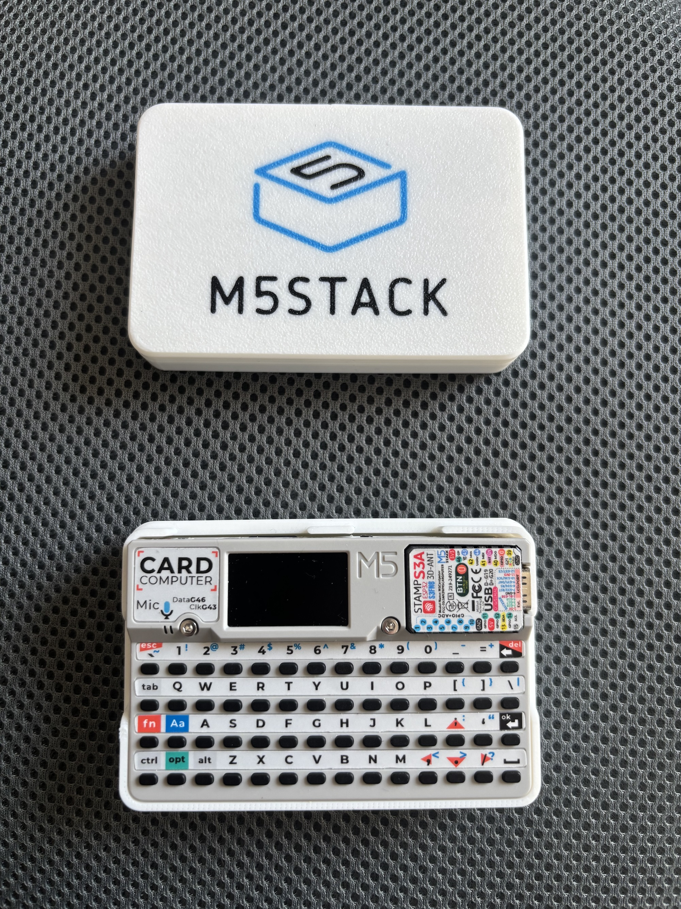
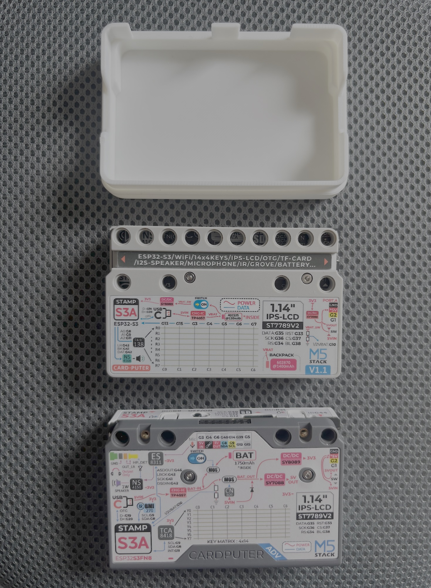
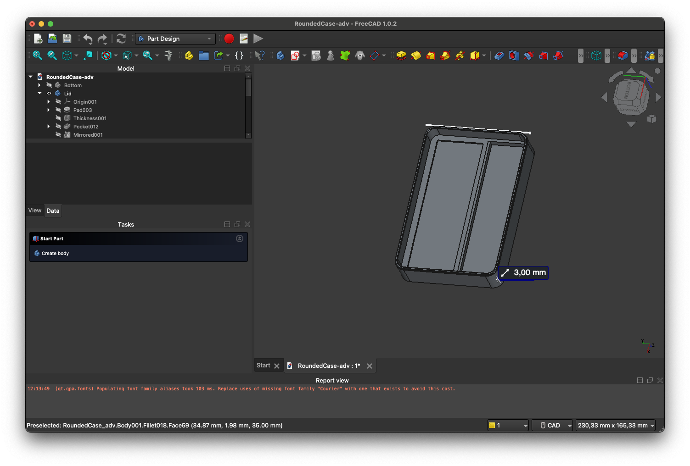
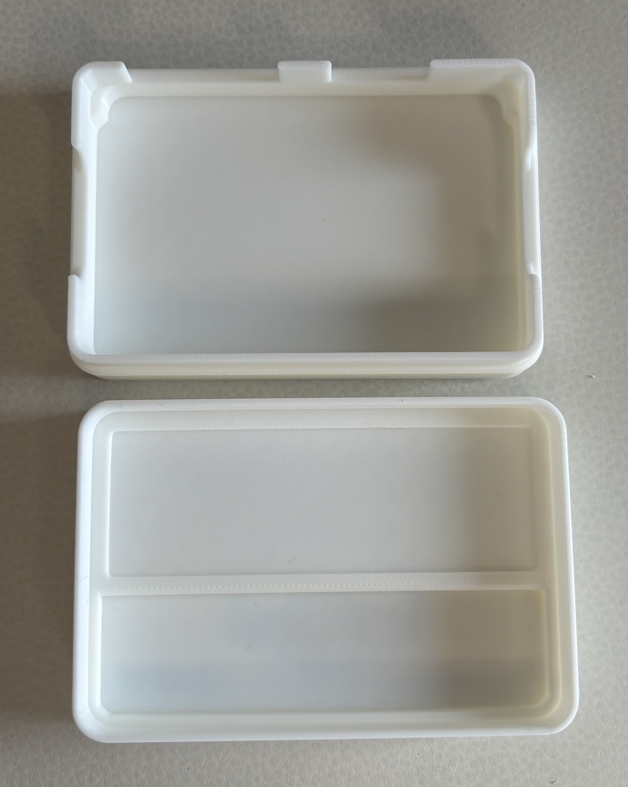
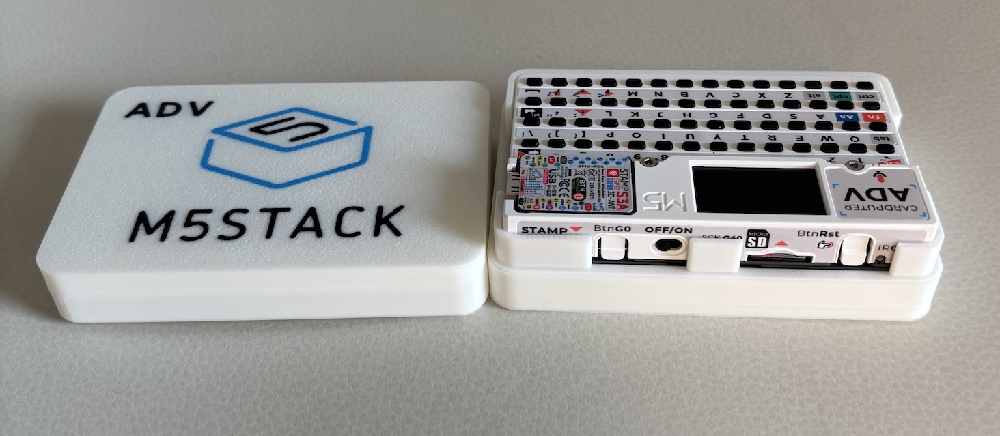

+++
title="A 3D printed case for the Cardputer ADV"
date="2026-03-19"
[taxonomies]
tags = ["3D", "cardputer", "freecad"]
categories = ["3D printing"]
+++
While scrolling on reddit last year, I discovered the existence of the [M5 Stack Cardputer device](https://shop.m5stack.com/products/m5stack-cardputer-with-m5stamps3-v1-1?variant=46108291432705) with the promise to be a cheaper alternative to the [Flipper zero.](https://flipper.net)

I ordered one on AliExpress and installed the [bruce firmware](https://bruce.computer) once received. I was amazed how this little device and this OSS code would be able to do out of the box.
I found a nice 3D printed case on [printables from hippazoid](https://www.printables.com/model/982071-m5stack-cardputer-case-with-m5stack-logo) that matched perfectly the device.

Later on, I ordered the Cardputer ADV to take advantages of the new pin-out system for board. I printed a second case without realising that the case for the ADV version will not fit inside the 1.1 case.

That was the opportunity to test [FreeCAD](https://www.freecad.org) to adapt the for the ADV version.

I redesign both lid and bottom part of the original case from scratch and take measurements from the original model using the measurement tool from [BambuStudio](https://bambulab.com/en/download/studio).
To adapt the bottom part, I used measurements from this [ADV stand model](https://www.printables.com/model/1414444-m5stack-cardputer-adv-stand) from printables.com

I am glad with the result. Some fillets on bottom and to faces have been forgotten 😅

You can find the models here:
* [MakerWorld](https://makerworld.com/fr/models/2248402-m5stack-adv-cardputer-case-with-m5stack-logo#profileId-2448238)
* [Printables](https://www.printables.com/model/1556940-m5stack-adv-cardputer-case-with-m5stack-logo)