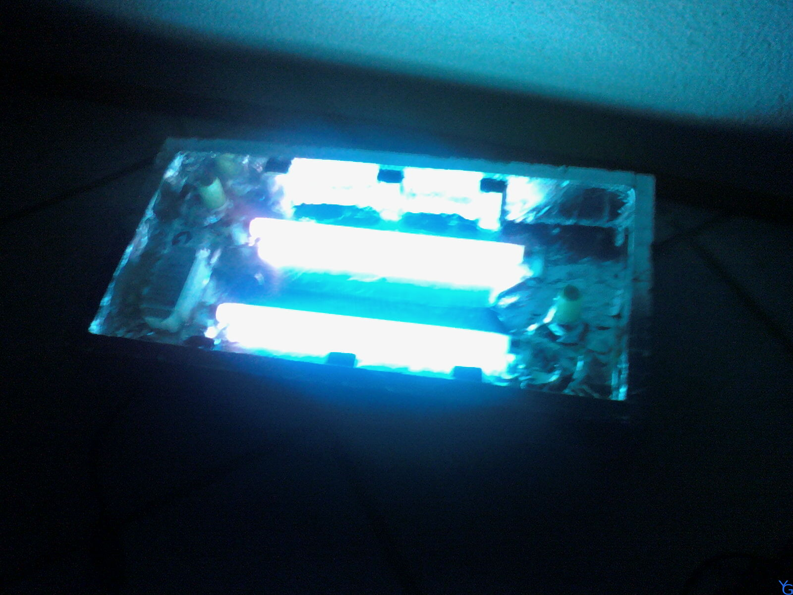

Comment fabriquer une insoleuse pour réaliser des circuits imprimés  ? Cette question m'a trotté dans l'esprit un bon moment !

J'ai alors regardé sur le grand Internet pour avoir des pistes de reflexion.  J'ai trouvé la liste du matériel pour fair e une insoleuse à deux néons :

*	Deux tubes néons.
*	Un ballast.
*	Deux starters. Deux supports pour starters.
*	Quatres supports pour néons. (2 par extrémité)

Après quelques recherches, mon matériel exact est :
*	Deux néons 8 watts.
*	Un ballast 18 watts.
*	Deux starters 4-22 watts series ST-151 de chez OSRAM.
*	Quatre supports pour néons.
*	Deux supports pour ballast.

Vous pourrez trouver ce matériel chez tous les grands fournisseurs en ligne. Pour ma part je suis aller chez Conrad.  Seul hic, il n'avait plus de ballast, j'ai du me fournir chez un fournisseur près de chez moi pour trois fois le prix internet (SIEHR pour ceux qui ne recevront pas de ballast non plus :-( ).  Pour les starters, j'en ai racheté dans le magasin de luminaire du coin,n'ayant pas remarqué que ceux que j'avais commandé aurait été bons (je ne l'ai remarque que plus tard. Mais ouf, un starter c'est moins de 1 € ).

**Explications :**

Le choix des composants est lié au choix des tubes. Vous devez déterminer combien de tubes vous souhaitez prendre. Cela dépends de la taille des circuits que vous souhaitez réaliser.  J'ai choisi deux petits néons parce que je ne savais pas trop quoi prendre et que j'avais déja entendu via des forums que des personnes avaient opté pour cette solution et que cela marchait. Dans mon cas, nous avons une puissance de 16 watts (2 fois 8 watts).

Le ballast est choisi en fonction des tubes. Je dois fournir 16 watts à mes tubes. J'ai pris un ballast 18 watts de chez ets spanien (ref: `a mettre). La puissance indiquée sur le ballast est la puissance qu'il fournit sous une certaine tension(généralement celle du secteur, cette tension est toujours notée sur le ballast). Attention donc à ne pas prendre un trop grand ballast sous peine de faire griller les néons.

Réalisation

Le schéma électrique du montage est le suivant, il est différent du schéma de placement des composants.

**Révélation et gravure :**

Pour cette partie je vous redirige sur cette page, très très bien faite :

[Bidouille électronique](http://www.bidouille.org/electronique/gravure/index.fr.php)

Quelques images du projet :

